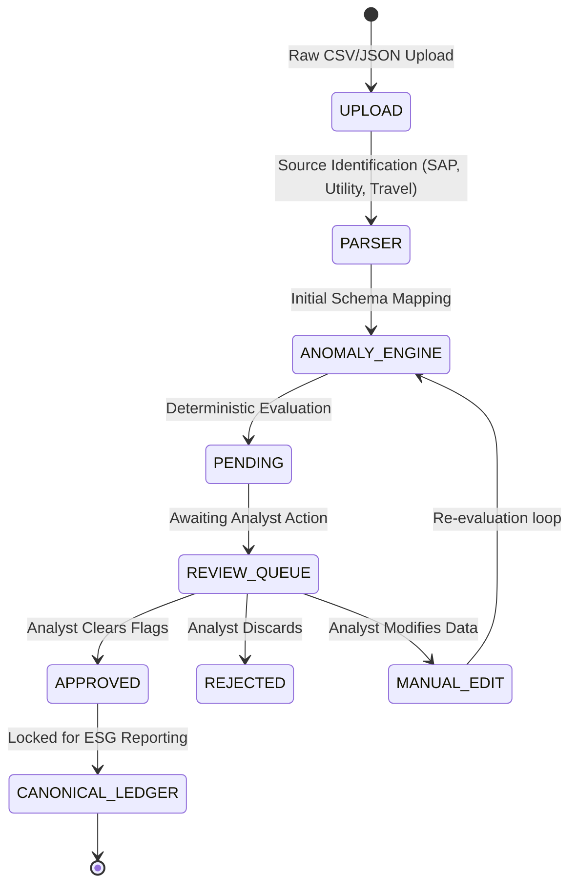
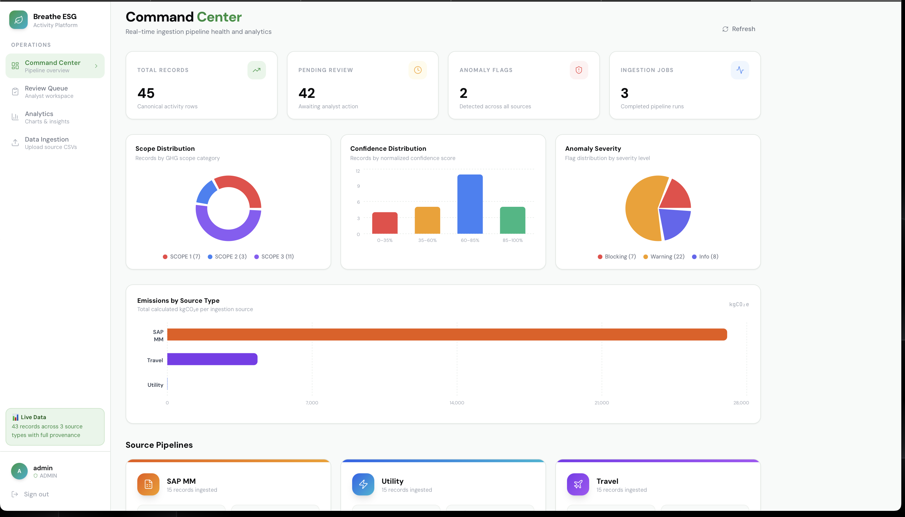
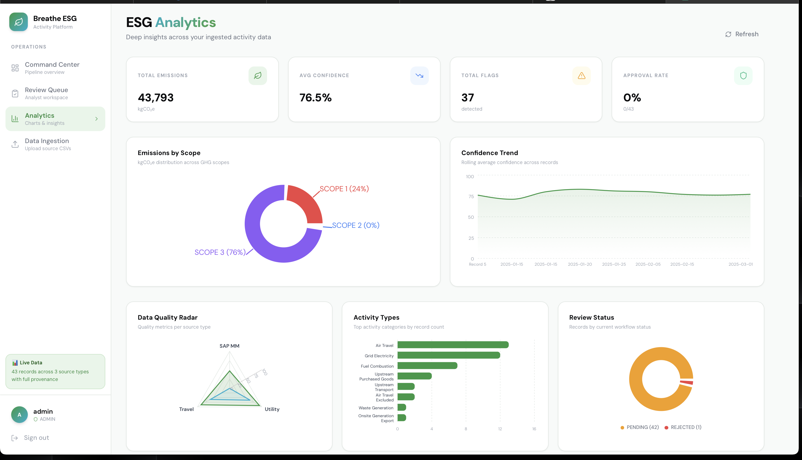
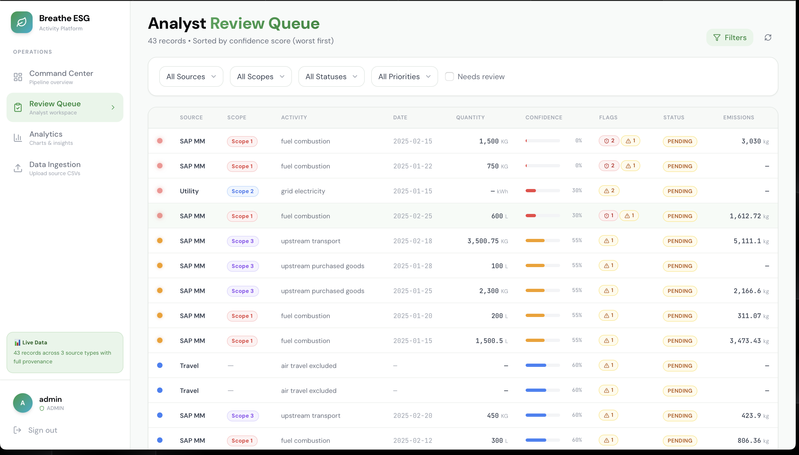
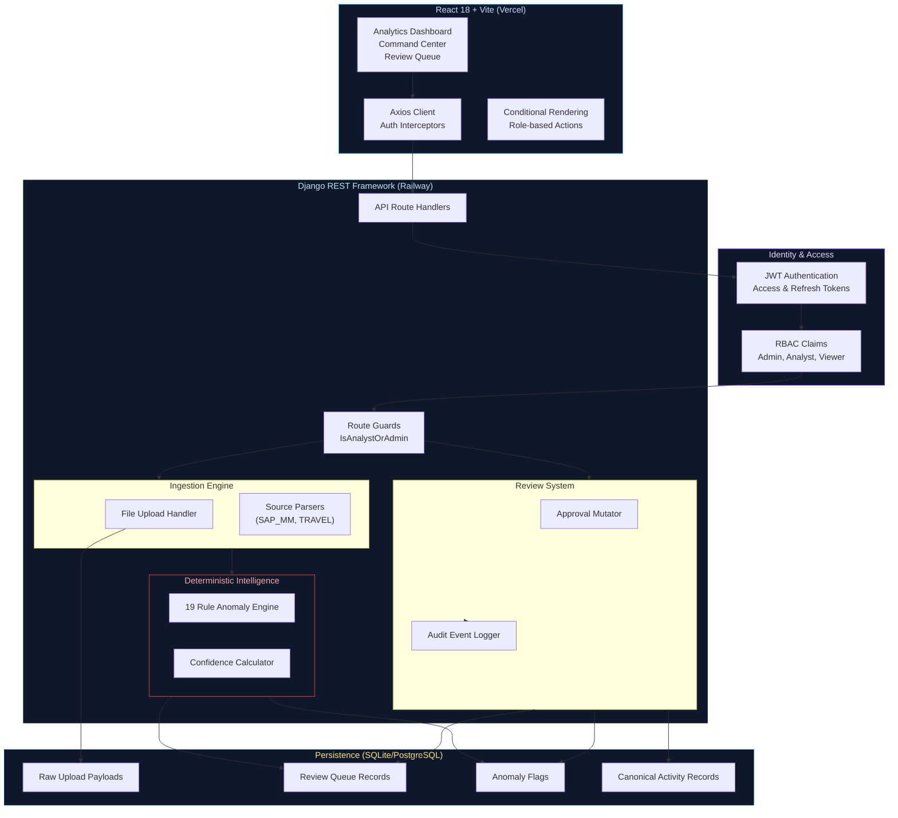

<div align="center">

<br/>

    ██████╗ ██████╗ ███████╗ █████╗ ████████╗██╗  ██╗███████╗
    ██╔══██╗██╔══██╗██╔════╝██╔══██╗╚══██╔══╝██║  ██║██╔════╝
    ██████╔╝██████╔╝█████╗  ███████║   ██║   ███████║█████╗  
    ██╔══██╗██╔══██╗██╔══╝  ██╔══██║   ██║   ██╔══██║██╔══╝  
    ██████╔╝██║  ██║███████╗██║  ██║   ██║   ██║  ██║███████╗
    ╚═════╝ ╚═╝  ╚═╝╚══════╝╚═╝  ╚═╝   ╚═╝   ╚═╝  ╚═╝╚══════╝
                                                         
                  ███████╗███████╗ ██████╗ 
                  ██╔════╝██╔════╝██╔════╝ 
                  █████╗  ███████╗██║  ███╗
                  ██╔══╝  ╚════██║██║   ██║
                  ███████╗███████║╚██████╔╝
                  ╚══════╝╚══════╝ ╚═════╝ 

### The Audit-First ESG Data Pipeline & Governance Platform

*Not a visualization dashboard. The deterministic ingestion layer that normalizes activity data before it ever hits a canonical report.*

<br/>

[](https://www.python.org/)
[](https://www.djangoproject.com/)
[](https://react.dev/)
[](https://tailwindcss.com/)
[](https://www.sqlite.org/)
[](/)
[](LICENSE)

<br/>

[**Live Platform**](https://breathe-esg-platform-omega.vercel.app) · [**Live Demo**](#demo-credentials) · [**Architecture**](#architecture) · [**Setup**](#quick-start)

<br/>

---

</div>

# Live Access

### Production Deployment (Vercel)

[Open Breathe ESG Live](https://breathe-esg-platform-omega.vercel.app/)

---

## The Problem

> **ESG reporting doesn't fail because of math. It fails because no one can prove the provenance of the underlying activity data.**

When building enterprise sustainability reports (Scope 1, 2, 3), organizations face a structural integrity problem:

*   **Garbage In, Garbage Out**: Raw utility bills, travel logs, and SAP extracts are messy, use contradictory units of measure, and contain missing fields.
*   **The Dashboard Illusion**: Most platforms just plot unverified data on a chart. If a user uploads `1000 tons` instead of `1000 kg`, the dashboard blindly displays it.
*   **Zero Auditability**: When auditors ask *"Where did this emission number come from?"*, the answer is usually a broken link to a spreadsheet on someone's laptop.

Breathe ESG solves this. We do not just visualize data. We intercept it, validate it deterministically, flag anomalies, and require a strict human-in-the-loop approval before it ever reaches a canonical reporting ledger.

---

## What Breathe ESG Delivers

<table>
<tr>
<td width="33%">

### Deterministic Ingestion
The extraction engine that parses messy, source-specific payloads into a standardized intermediate schema.

*   **Source-Specific Parsers** for SAP MM, Utility Intervals, and Concur Travel.
*   **19 Deterministic Anomaly Rules** catching cross-dimensional UOM errors, orphaned metadata, and impossible dates.
*   **Algorithmic Confidence Scoring** based on data density and anomaly severity.

</td>
<td width="33%">

### Analyst Review Layer
The governance checkpoint where human analysts review blocked data, resolve flags, and approve records.

*   **Prioritized Review Queue** sorting records by lowest confidence first.
*   **5-Tab Provenance Drawer** showing the raw JSON payload, normalization history, and audit timeline.
*   **Mutation Control** allowing analysts to manually correct units or categories before canonicalization.

</td>
<td width="33%">

### Operational Intelligence
The control tower for observing ingestion health, data quality, and team throughput.

*   **Data Quality Radar** plotting source reliability across confidence, cleanliness, and coverage axes.
*   **Confidence Trend Analysis** mapping rolling averages over time.
*   **Status Distribution** monitoring the backlog of `PENDING` vs `APPROVED` vs `REJECTED` records.

</td>
</tr>
</table>

---

## The Ingestion Lifecycle

Breathe ESG models data provenance as a strict, unidirectional pipeline. A record cannot jump the queue; it must be parsed, evaluated, and approved.



This strict lifecycle guarantees:
* **Traceability**: Every canonical record links directly back to its raw upload payload.
* **Accuracy**: High-severity anomalies (`BLOCKING`) physically cannot enter the canonical ledger until human intervention occurs.

---

## Product Walkthrough

### 1. Ingestion Command Center
The nerve center of the pipeline. Upload messy data and watch the deterministic engine process, flag, and route records.


---

### 2. ESG Analytics
Operational intelligence and data quality observability based on canonical ledger records.


---

### 3. Review Queue & Provenance Drawer
The analyst governance layer. Full auditability of JSON payloads, rule flags, and deterministic scoring.


---

## Architecture

Breathe ESG is a decoupled architecture built for data integrity. The backend acts as a strict state machine and validation engine, while the frontend provides a high-performance, real-time operating center for analysts.



---

## Feature Matrix

| Capability | Analyst / Admin | Viewer |
| --- | --- | --- |
| **View Analytics & Dashboards** | Full Access | Full Access |
| **Inspect Provenance Drawer** | Full Access | Read-Only |
| **Upload Raw Files** | Allowed | 🚫 Blocked (UI & API) |
| **Approve / Reject Records** | Allowed | 🚫 Blocked (UI & API) |
| **Resolve Anomaly Flags** | Allowed | 🚫 Blocked (UI & API) |
| **Manual Data Edits** | Allowed | 🚫 Blocked (UI & API) |

---

## Demo Credentials

The system enforces strict RBAC (Role-Based Access Control). Test the platform using these pre-seeded roles. 

> **Password for all accounts:** `esg2025`

| Role | Username | Capabilities |
| --- | --- | --- |
| **Admin** | `admin` | Full system access, capable of uploading, editing, approving, and managing users. |
| **Analyst** | `analyst` | The core operator. Can process the review queue, mutate records, and clear anomaly flags. |
| **Viewer** | `viewer` | Executive stakeholder. Can view all charts, metrics, and queues, but cannot alter the state of any record. |

---

## Local Quick Start

### 1. Backend (Django)

```bash
cd backend

# Setup Virtual Environment
python3 -m venv venv
source venv/bin/activate
pip install -r requirements.txt

# Run migrations & seed data
python manage.py migrate
python manage.py seed_reference_data
python manage.py seed_sample_data

# Start server
python manage.py runserver 8000
```

### 2. Frontend (React/Vite)

```bash
cd frontend

# Install dependencies
npm install

# Start development server
npm run dev
```

---

## Production Deployment

### 1. Frontend (Vercel)
The React application is fully optimized for Vercel deployment with Vite. 
* Import the repository into Vercel.
* Set the Root Directory to `frontend`.
* The `Vite` preset will automatically handle routing and build configurations. Vercel Web Analytics is natively integrated.

### 2. Backend (Railway / Render)
The Django API can be deployed to any containerized PaaS.
* Ensure `DJANGO_SETTINGS_MODULE=config.settings.production`
* Set `DATABASE_URL` to provision a PostgreSQL database in place of local SQLite.

---

<div align="center">
  <p className="text-sm text-gray-500">
    Built for deterministic accuracy. Because compliance requires proof, not just charts.
  </p>
</div>
